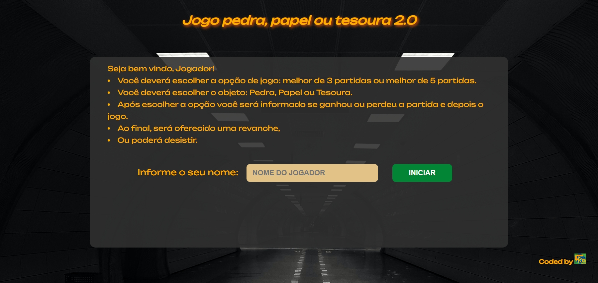
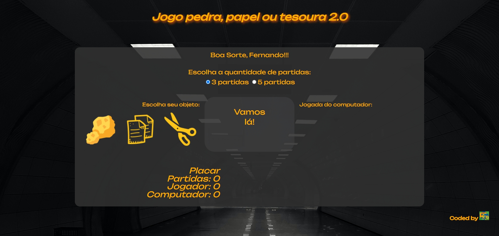
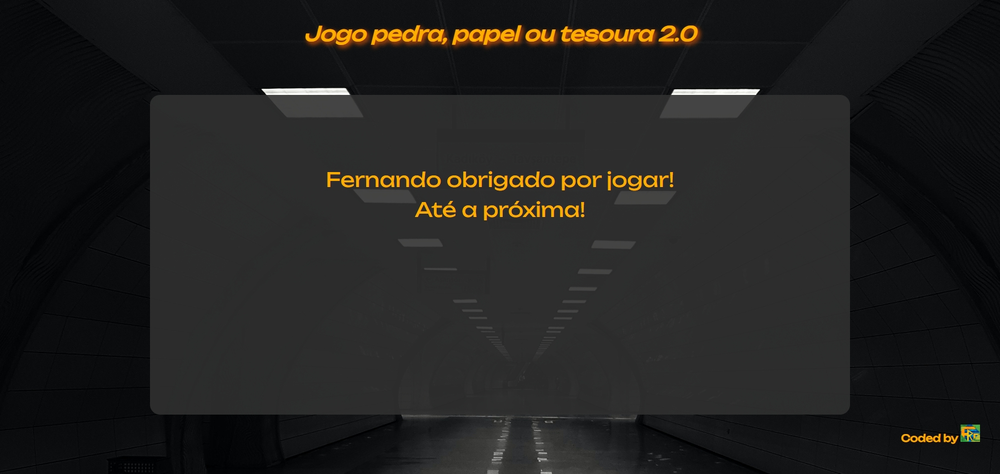
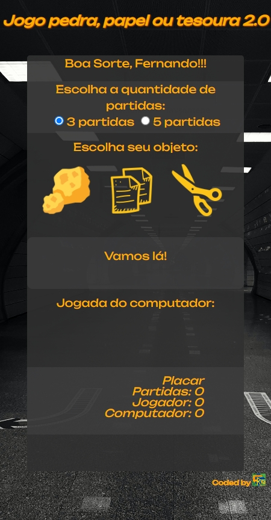
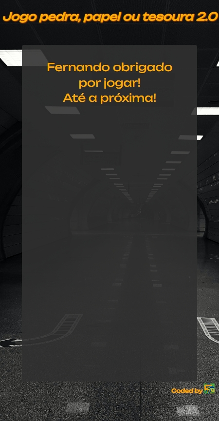
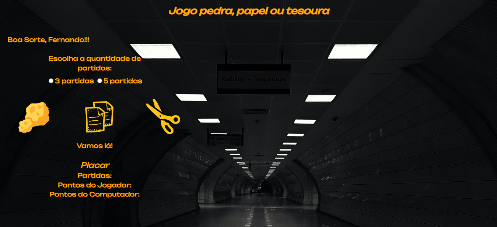

# Jogo Pedra, Papel ou Tesoura em TypeScript

## Índice

- [Visão Geral](#visão-geral)
  - [O Desafio](#o-desafio)
  - [Screenshot](#screenshot)
  - [Links](#links)
- [Meu processo](#meu-processo)
- [Autor](#autor)

## Visão Geral

### O Desafio

Reconstruir o meu jogo em Typescript tentando manter o layout, melhorando a jogabilidade e a responsividade:

- O jogador deverá escolher a opção de jogo: melhor de 3 partidas ou melhor de 5 partidas.
- O jogador deverá escolher o objeto: Pedra, Papel ou Tesoura.
- Após escolher a opção o jogador será informado se ganhou ou perdeu a partida e depois o jogo.
- Se ganhou o jogo será parabenizado.
- Se perdeu será informado e será oferecido uma revanche.

### Screenshot

### Links

- Site URL: [Jogo Pedra, Papel ou Tesoura 2.0](https://jogo-pedra-papel-tesoura-ts.vercel.app/)
- Site URL: [Jogo Pedra, Papel ou Tesoura 1.0](https://jogo-pedra-papel-tesoura-rho.vercel.app/)
- Código da versão 1.0: [Jogo Pedra, Papel ou Tesoura 1.0](https://github.com/fernando-r-costa/JogoPedraPapelTesoura)

## Meu processo

- [x] Desktop-design
- [x] Mobile-design
- [x] Interação

## Autor

- LinkedIn - [Fernando R Costa](https://www.linkedin.com/in/fernando-r-costa/)